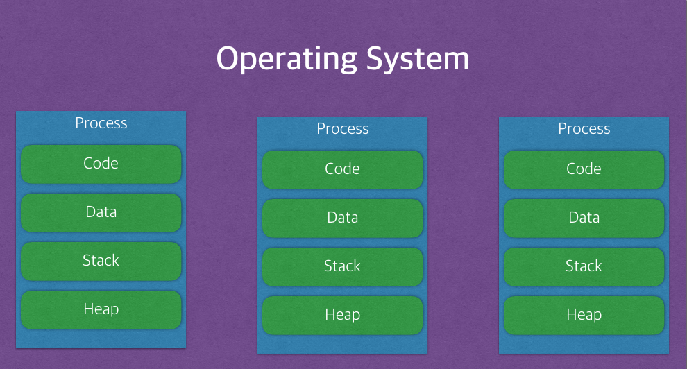

안녕하세요. 마기입니다. 개발 관련 블로그 정리 첫 시간입니다.

공부한 내용 정리 목적 및 공유를 위해 공부하는 내용을 하나하나 블로그에 정리할 생각입니다.

이번 시간에는 기본이지만 의외로 누군가가 질문을 해올때 멈칫하는 내용을 한번 정리해 보았습니다.

프로세스(process)와 스레드(thread)에 대한 정리 입니다.

## 프로세스 (process)

프로세스의 사전적 의미를 찾아보면 아래와 같이 정의를 내립니다.

> _컴퓨터에서 연속적으로 실행되고 있는 컴퓨터 프로그램_

이 한줄의 정의만으로 이해를 하는 분들이 있는 반면, 어려운 분들도 계십니다.

프로세스를 프로그램과 비교해서 생각하시면 이해 하시기 쉽습니다.

여러분의 컴퓨터에는 프로그램이 설치 되어 있습니다. 게임도 있고.. 문서작성 프로그램도 있고..

기본으로 제공되는 프로그램들도 있겠죠.. 하드 디스크에 잘 설치 되어 있을겁니다.

프로세스는 하드 디스크에 설치 되어 있는 프로그램을 메모리상에 실행중인 작업 입니다.

과거의 운영체제(MS-DOS 등)는 한번에 한가지 작업밖에 할수가 없었죠.

하지만 요즘 운영체제는 한번에 여러가지 작업을 동시에 할수 있습니다.

대표적인 운영체제는 윈도우, 리눅스, 유닉스 등이 있습니다.

이러한 운영체제에서 여러개의 프로그램을 동시에 실행 하는 것을 멀티태스킹이라고 하고

하나의 프로그램내에서 여러가지 작업을 동시에 실행 하는 것을 멀티프로세싱이라고 합니다.

## 프로세스 특징 및 멀티 프로세싱의 단점

프로세스는 프로그램 실행시 Code, Data, Stack, Heap의 구조로 되어있는 독립된 메모리 영역을 할당 받습니다.

   
이러한 특징은 멀티 프로세싱 방식에서 단점을 가지게 됩니다.

멀티 프로세싱의 방식은 CPU에서 여러 프로세스를 로테이션으로 돌면서 처리를 하게 됩니다. (스케쥴링 알고리즘)

동작중인 프로세스가 대기를 타면서 해당 프로세스의 상태(Context)를 보관하고,

대기하고 있던 다음 순번의 프로세스가 동작하면서 이전에 보관했던 프로세스의 상태(Context)를 복구하게 됩니다.

이러한 일련의 과정을 Context Switching 이라고 하는데 프로세스는 각각 독립된 메모리 영역이다 보니

캐쉬 메모리 초기화 등 꽤나 무거운 작업이 진행되고 오버헤드가 발생하게 됩니다.

  

## 스레드 (thread)

스레드의 사전적 의미를 찾아보면 아래와 같이 정의를 내립니다.

> _프로세스 내에서 실행되는 여러 흐름의 단위_

말 그대로 스레드는 프로세스에서 동작하는 여러 실행의 흐름입니다.

기본적으로 프로세스당 최소 1개의 스레드를 가지고 있고 그것을 메인 스레드라고 합니다.  

프로세스는 1개 이상의 스레드를 가질수 있으며 멀티스레드라고 합니다.

위에서 설명한 Context Switching은 사실 프로세스가 가지고 있는 스레드를 처리하는 과정입니다.

## 스레드의 특징 및 멀티스레딩의 장단점

스레드는 프로세스 내에서 각각 Stack만 따로 할당을 받고 Code, Data, Heap 영역을 공유합니다.

  

이러한 특징은 여러가지 장점을 가지게 됩니다.

먼저 메모리를 공유하다보니 독립적인 프로세스와는 달리 스레드간 데이터를 주고 받는게 간단해지고

시스템 자원 소모가 줄어들게 됩니다. 응답 시간 또한 단축 되구요.

그리고 멀티프로세싱의 단점인 Context Switching의 오버헤드에 대한 부분을 해결해 줍니다.

프로세스와는 달리 Code, Data, Heap 영역을 공유하므로 Stack 영역만 처리를 하면 되고

그 결과 처리 비용이 감소하게 됩니다.

더군다나 프로세스 Context Switching의 경우 캐쉬 메모리를 초기화 하게 되지만

스레드는 메모리를 공유하므로 꽤 큰 처리 비용이 드는 초기화를 할 필요가 없어집니다.

하지만 멀티스레드가 장점만 있는 것은 아닙니다.

여러 스레드가 동시에 작업을 하다보면 공유된 데이터를 서로 사용하다가 충돌이 일어날 가능성이 큽니다.

또한 개발시 디버깅도 꽤나 까다로워 집니다. 쉽게 버그가 생기기도 쉽구요.

스레드의 장단점을 정리하자면 이렇습니다.

|||
|------|---------------------------------------------------------------------------------------------------------------------------------------|
| 장점 | 1. 메모리 공유로 인한 시스템 자원 소모가 줄어 듭니다. 2. 응답시간이 단축 됩니다. 3. Context Switching 에 대한 오버헤드가 줄어 듭니다. |
| 단점 | 1. 서로 데이터를 사용하다가 충돌이 일어날 가능성이 있습니다. 2. 디버깅이 다소 까다로워 집니다. (버그 생성될 가능성 증가)              |
