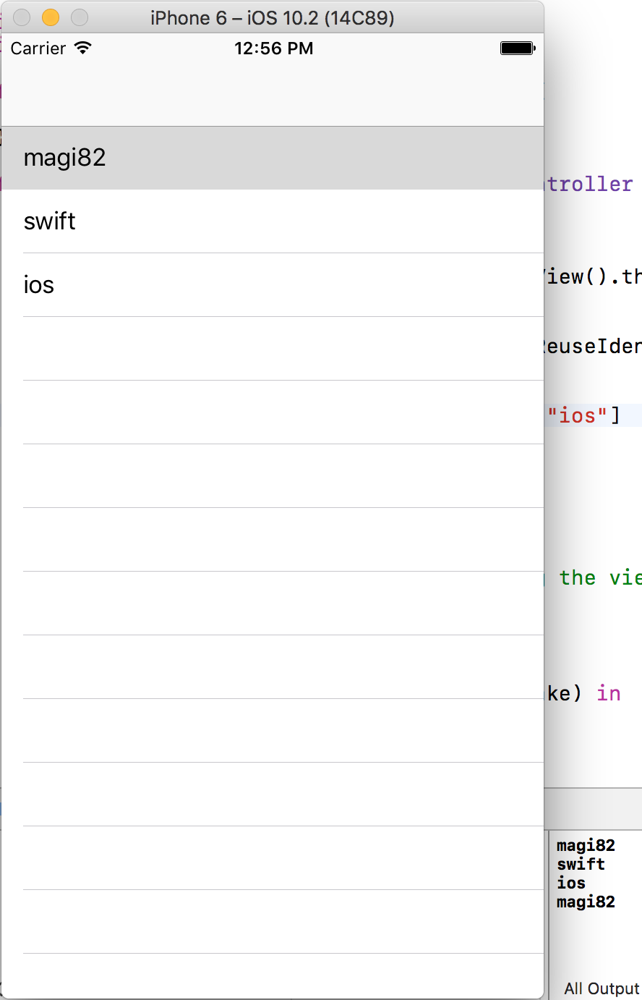

안녕하세요. 마기입니다. 당분간 Swift 혹은 ios 관련 내용으로 포스팅할 예정입니다.

해외에는 ios 프로젝트에서 storyboard를 사용할지 xib를 사용할지 code로

구현할지에 대한 이슈가 엄청난 핫이슈 라고 합니다. (서로 맨날 싸운다나..)

다 할줄 알면 손해는 없으니 당분간 code로 구현하는 방법을 포스팅할 예정입니다.

이번 포스트는 code로 UITableView 구현하는 내용입니다.

해당 코드는 Swift3 기반입니다.

 

### 프로젝트 생성

xcode에서 프로젝트를 생성합니다. 기본적으로 ViewController만 있으면 됩니다.

> Xode -> New -> Project -> Single View Application

 

### 멤버 변수 선언 및 생성

ViewController 클래스를 열고 그냥 멤버변수로 UITableView를 선언 해주세요.

실제로 테스트할 변수도 추가해 주도록 합시다.

 

### UITableViewDelegate, UITableViewDataSource 추가

UITableView와의 연동을 위한 프로토콜을 구현 해보도록 합시다.

얼마전까지는 ViewController 클래스 자체에 프로토콜을 구현 했었지만

요즘은 extension을 많이 사용 합니다.

 

### UITableView 프로퍼티 세팅후 ViewController에 추가

먼저 테이블뷰에 연동할 프로토콜이 구현된 클래스를 넣어줍니다.

 

그리고 테이블뷰에 표현될 테이블뷰셀을 등록 해줍니다.

일단은 기본 테이블뷰셀을 사용하도록 하겠습니다.

세팅이 끝나면 실제 뷰컨트롤러의 view에 추가를 해줘야 합니다.

 

단순히 코드로만 만들기 위해 테이블뷰의 크기도 직접 설정을 해주도록 합시다.

제약사항을 뷰컨트롤러의 view와 같은 크기로 맞춥니다.

> note: 제약사항을 코드로 처리하기엔 너무 지저분해 보이네요. 
> 오픈소스로 제약사항을 쉽고 깔끔하게 사용할수 있습니다. 
> 그중에 유명한 [snapkit](https://github.com/SnapKit/SnapKit/)을 추천드립니다. 

 

### UITableViewDelegate, UITableViewDataSource 프로토콜 구현

이제 실제 테이블뷰에서 사용할 두가지 프로토콜을 구현해봅시다.

먼저 UITableViewDataSource 구현하도록 합시다.

표현할 데이터 리스트의 count를 return 해주고 cell을 dequeueReusableCell

한다음 textLabel에 값을 넣고 return 해주면 끝입니다.

withIdentifier는 아까 사용할 테이블뷰셀을 등록할때 정했던 String을

넣어야 합니다.

 

마지막으로 UITableViewDelegate를 구현합시다.

테이블뷰셀을 터치시 해당 내용이 콘솔에 print 되는 코드 입니다.

 

### 풀 소스

자 이제 구현이 끝났습니다. 설명을 위해 띄엄띄엄 코드를 올렸더니 햇갈릴거 같아서

아래 풀소스를 적어 두었습니다.

 

### 결과

결과 스크린샷을 보시면 아시겠지만 3개의 리스트가 테이블뷰에 보여지고 있고 터치시

콘솔창에 print 됩니다.

