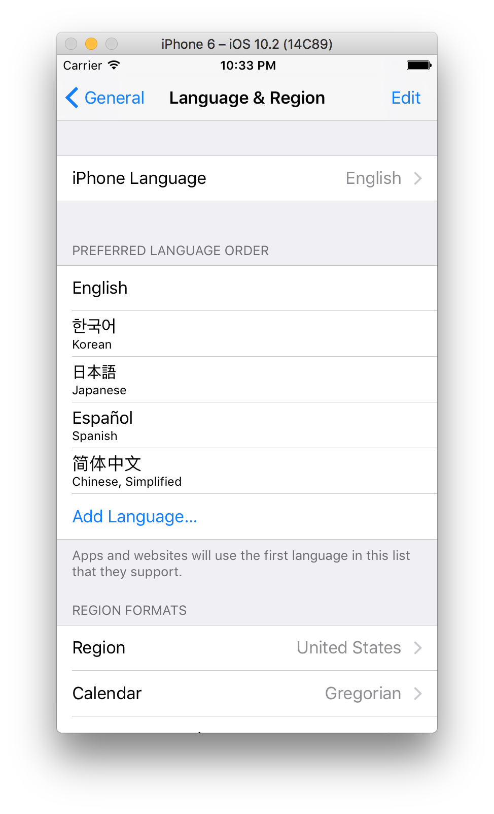
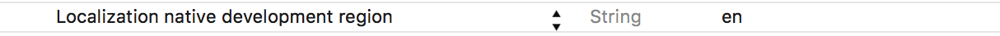

안녕하세요. 마기입니다. 이번 포스트는 ios의 localization(지역화)가

적용되는 순서에 대해서 간단하게 정리 하려고 합니다.

이글을 포스트 하는 현재 ios 버전은 10.3.1입니다.

 

지역화를 작업하게 되면 Localizable.strings 파일이 생성이 됩니다.

기본적인 base를 포함해서 적용된 언어별로 생성이 됩니다.

디바이스에서 iPhone 언어를 선택하면 해당 언어의 string이 적용됩니다.

자 여기까지는 일반적인 내용 입니다. 디바이스가 지역화를 하지 않은 언어를

선택하게 되면 어떻게 되는지 알아보겠습니다.

 

디바이스의 언어 및 지역 설정에 선호 하는 언어 순서 라는 메뉴가 있습니다.

해당 언어의 순서대로 체크후 지역화가 되었다면 string이 적용 됩니다.

예를 들어 한국어, 일본어 지역화를 적용한 상태에서 앱을 실행하면

위의 스크린샷의 순서에 의해 한국어가 우선적으로 선택이 됩니다.

 

자 한가지 더 살펴볼 내용이 있습니다.

지역화 작업시 기본적인 base 파일이 존재합니다.

해당 파일은 어디서 사용하는지 알아보겠습니다.

앱의 info.plist 파일에 보면 지역화 관련 값이 있습니다.

위 스크린샷의 옵션은 기본 지역화에 사용되는 값을 지정합니다.

첫번째 스크린샷의 선호하는 언어 순서 목록중에 지역화를 적용한 언어가

하나도 없다면 두번째 스크린샷에서 세팅한대로 영어가 적용이 됩니다.

자 여기서 만약 영어 지역화 작업을 하지 않았다면?

base의 string 값을 사용하게 됩니다.
