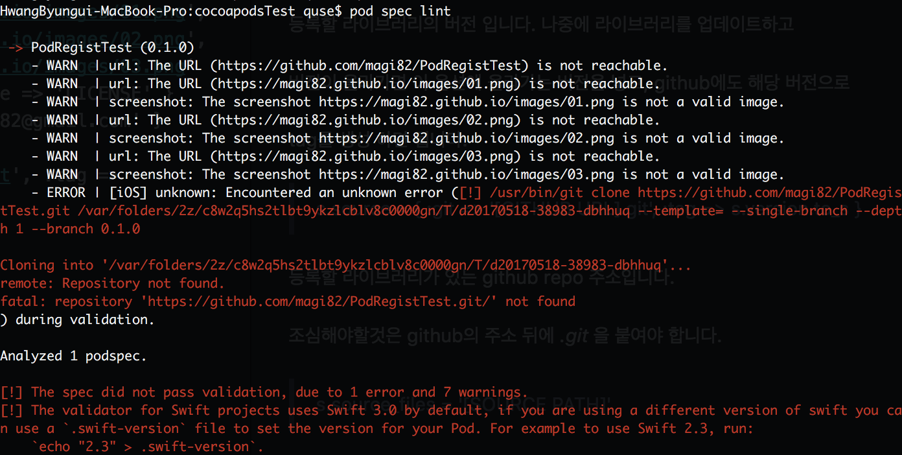
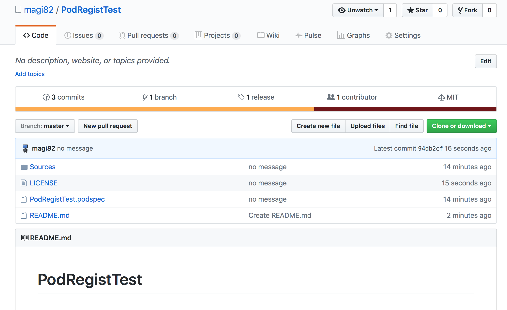
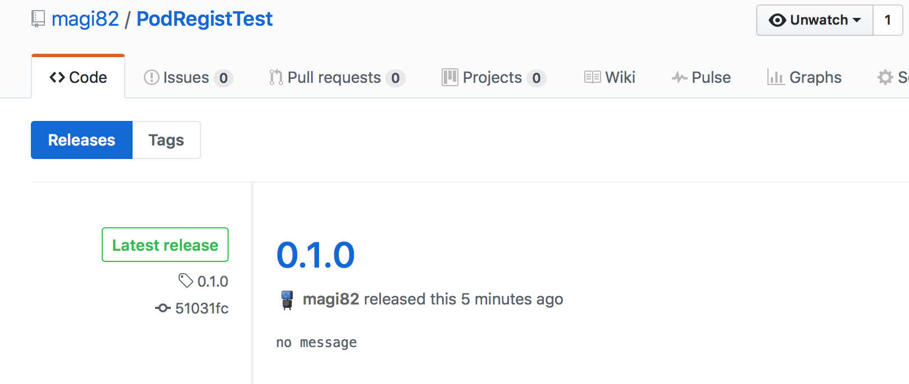
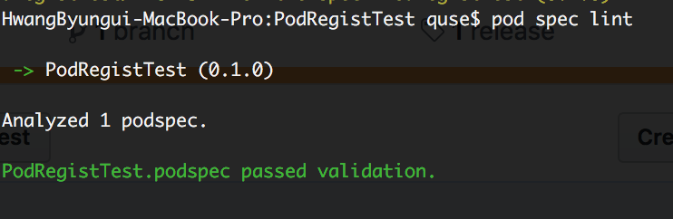
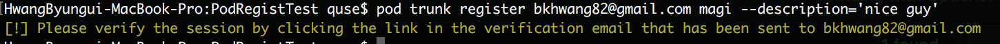
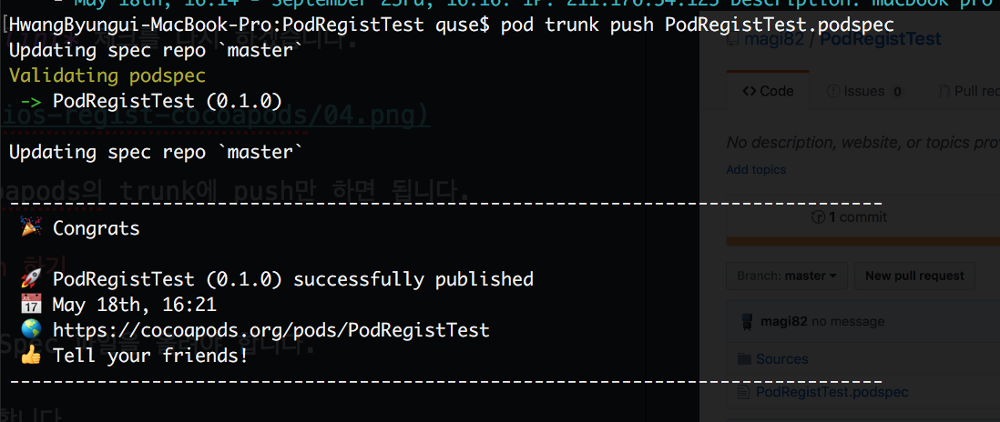

안녕하세요. 마기입니다. 이번에는 직접 제작한 라이브러리를
<br>
cocoapods에 깔끔하게 등록하는 방법을 포스팅 하려고 합니다.

cocoapods는 Obj-C, Swift 라이브러리를 설치, 배포 할수 있는
<br>
의존성 관리 도구 입니다.
<br>
일반적으로는 iOS 개발시 다른 개발자들의 라이브러리를 이용할 목적으로
<br>
사용하지만, 라이브러리를 오픈소스로 만들어서 기여하거나
<br>
본인이 사용하는 코드들을 모아두고 여러 프로젝트에서 쉽게 사용할 목적으로
<br>
라이브러리를 등록하기도 합니다.
<br>
보통은 pod에서 지원하는 라이브러리 프레임워크 생성 명령을 통해서
<br>
라이브러리 프레임워크를 만들고 배포하지만, 이번 포스트에서는
<br>
라이브러리를 깔끔한 구조로 배포하는 방법을 알아보도록 하겠습니다.

> 이 포스트는 cocoapods을 이미 설치해서 쓴다는 가정하에 진행됩니다.

#### podSpec 파일 생성하기

cocoapods의 홈페이지에 있는 가이드 문서중 [making-a-cocoapod](https://guides.cocoapods.org/making/making-a-cocoapod.html) 를 보면
<br>
터미널에서 명령을 통해서 라이브러리를 만들수 있다고 나옵니다.

> pod lib create [pod name]

이 명령을 사용하면 example 프로젝트와 Pod 프로젝트,
<br>
프로젝트를 통합한 워크스페이스 등등.. 뭔가 좀 복잡하게 만들어집니다.

하지만 기본적으로 cocoapods에 등록되는건 프로젝트가 아닌 그냥
<br>
라이브러리의 파일들입니다. 아래에서 설명할 podSpec 파일에
<br>
라이브러리 파일들이 있는 경로만 지정해주면 됩니다.
<br>
굳이 프로젝트를 만들지 않아도 됩니다.

spec 파일만 따로 만드는 방법 또한 cocoapods 가이드 문서에 있습니다.
<br>
[Specs and the Specs Repo](https://guides.cocoapods.org/making/specs-and-specs-repo.html) 를 보면 podSpec 파일을 만드는 아래와 같은
<br>
명령을 알려주고 있습니다.

> pod spec create [pod name]

만들어진 파일을 열어보면 주석도 많고 꽤나 복잡 합니다.
<br>
아래에 깔끔하게 정리된 podSpec을 보면서 같이 만들어 보겠습니다.

#### podSpec 파일 만들기

```
Pod::Spec.new do |s|
  s.name             = '[YOUR POD NAME]'
  s.version          = '0.1.0'
  s.summary          = '[YOUR POD SUMMARY]'
  s.description      = <<-DESC
                      [YOUR POD DESCRIPTION]
                      DESC
  s.homepage         = '[GITHUB URL]'
  s.screenshots      = '[IMAGE URL 1]', '[IMAGE URL 2]'
  s.license          = { :type => 'MIT', :file => 'LICENSE' }
  s.author           = { '[ACCOUNT]' => '[E-MAIL]' }
  s.source           = { :git => '[GITHUB URL].git', :tag => s.version.to_s }
  s.ios.deployment_target = '8.0'
  s.source_files = '[SOURCE PATH]'
end
```

기본적으로 이정도만 작성해도 일반적으로 올리는데 문제는 없습니다.
<br>
대괄호로 감싸진 부분을 본인의 내용으로 수정만해도 사용할수 있습니다.
<br>
물론 더 많은 기능들도 있지만 차차 적용해보시면 될거 같습니다.
<br>
몇가지 중요한 옵션을 살펴보겠습니다.

> s.name = '[YOUR POD NAME]'

등록할 라이브러리의 이름입니다.
<br>
github repo, podSpec 파일이름 그리고 해당 옵션값 까지
<br>
같은 이름으로 통일해야 합니다.

> s.version = '0.1.0'

등록할 라이브러리의 버전 입니다. 나중에 라이브러리를 업데이트하고
<br>
버전이 올라가면 이 옵션에 올라가는 버전을 넣고, github에도 해당 버전으로
<br>
tag를 생성 하면 됩니다.

> s.source = { :git => '[GITHUB URL].git', :tag => s.version.to_s }

등록할 라이브러리가 있는 github repo 주소입니다.
<br>
조심해야할것은 github의 주소 뒤에 *.git* 을 붙여야 합니다.

> s.source_files = '[SOURCE PATH]'

등록할 라이브러리의 소스 파일이 있는 경로 입니다.
<br>
podSpec 파일은 github의 root path에 위치해야 합니다.
<br>
보통 소스는 하위 폴더에 있으므로 상대 경로로 지정해 줘야 합니다.

자! 이제 예제로 해당 대괄호의 내용을 집어 넣어 보겠습니다.
<br>
참고해서 본인에 맞게 수정해서 사용하세요.

```
Pod::Spec.new do |s|
  s.name             = 'PodRegistTest'
  s.version          = '0.1.0'
  s.summary          = 'test PodRegistTest.'
  s.description      = <<-DESC
Simple test the PodRegistTest!!!
                       DESC
  s.homepage         = 'https://github.com/magi82/PodRegistTest'
  s.screenshots      = 'https://magi82.github.io/images/01.png',
                       'https://magi82.github.io/images/02.png',
                       'https://magi82.github.io/images/03.png'
  s.license          = { :type => 'MIT', :file => 'LICENSE' }
  s.author           = { 'magi82' => 'bkhwang82@gmail.com' }
  s.source           = { :git => 'https://github.com/magi82/PodRegistTest.git', :tag => s.version.to_s }
  s.ios.deployment_target = '8.0'
  s.source_files = 'Sources/*.swift'
end
```

podSpec 파일 작성을 완료했으면 제대로 작성 되었는지
<br>
터미널에서 체크를 해야 합니다.
<br>
아래 명령을 사용하여 체크 할수 있습니다.

> pod spec lint

당연하게도 에러가 날겁니다. 한번에 될리가 없겠죠?



7개의 warning과 1개의 error가 떴네요..
<br>
일단 error를 살펴보면 대충 github repo를 찾을수 없다고 합니다.
<br>
당연하겠죠.. 아직 안올렸으니까.. ㅠㅠ
<br>
github repo 작업을 한다음 다시 살펴보도록 하겠습니다.

#### github repo 등록하기

일단 github repo를 생성후 프로젝트를 등록하는 방법에 대해서는
<br>
따로 이야기하지 않겠습니다. (구글 검색하면 많이 나옵니다.)

기본적으로 podSpec 파일은 repo의 root path에 위치하고 있어야 합니다.
<br>
그리고 아까 podSpec 파일을 세팅할때 라이브러리 소스의 상대경로 기억하시죠?
<br>
그 경로에 맞게 라이브러리 파일을 넣어야 합니다.
<br>
지금 만들고 있는 podSpec 파일에 적용된 경로는
<br>
`Sources/*.swift` 입니다.

그리고 라이브러리의 버전을 repo의 tag로 체크한다고 했었죠?
<br>
tag도 만들어 줍시다.
<br>
최종적으로 repo에 등록되는 라이브러리는 이런 형태를 띄게 됩니다.





7개의 warning은 스크린샷의 url이 틀렸다는 경고 입니다.
<br>
url까지 수정한 후에 *pod spec lint* 체크를 다시 하겠습니다.



이렇게 되면 성공입니다! 이제 cocoapods의 trunk에 push만 하면 됩니다.

#### cocoapods trunk에 push 하기

이제 cocoapods의 trunk에 podSpec 파일을 올려야 합니다.
<br>
먼저 cocoapods에 trunk를 등록합니다.

> pod trunk register [E-MAIL] [NAME] -description='[INFORMATION]'

그러면 입력했던 메일로 접속후 세션을 등록하라고 합니다.



메일 확인후 클릭을 합니다.
<br>
마지막으로 cocoapods의 trunk에 push만 하면 됩니다.

> pod trunk push [podSpec file name]

성공했습니다!


이제 다른 개발자들의 라이브러리처럼 Podfile을 이용해서 설치하고 사용하면 됩니다.

#### 마치며..

긴 여정 끝에 라이브러리를 cocoapods에 등록했습니다.
<br>
멋진 라이브러리를 만들어서 다른 개발자들이 사용해준다면..
<br>
정말 기분좋고 뿌듯할거 같습니다. 한번 도전해보세요. ^^
<br>
다음 포스트는 carthage 적용을 다뤄볼 생각입니다.
<br>
조만간에 뵙도록 하겠습니다.
