안녕하세요. 마기입니다. 지난 포스팅에 이어서 github에 올린 라이브러리를
 
carthage로 깔끔하게 지원하는 방법을 포스팅 하도록 하겠습니다.

carthage 역시 cocoapods와 마찬가지로 라이브러리를 설치, 배포 할수 있는
 
의존성 관리 도구 입니다.

carthage는 미리 빌드후 생성되는 framework를 프로젝트에 사용합니다.
 
그로 인해 cocoapods에 비해서 두가지 장점이 있습니다.
 
일단 미리 빌드하기 때문에 매번 라이브러리를 빌드해야하는 cocoapods보다
 
빌드 시간이 단축 됩니다.
 
그리고 워크스페이스를 만들 필요가 없습니다.
 
framework를 추가하는 방법이 살짝 복잡하기는 하지만 두가지 장점 때문에
 
꽤나 매리트가 있습니다.
 
다만 아직까지는 많은 라이브러리들이 cocoapods에 비해
 
carthage를 많이 지원하고 있지 않습니다.

여담으로 개발자들이 carthage를 발음하는 종류가 여러가지 있습니다.
 
보통은 카르타고라고 부릅니다. 라틴어라네요.
 
영어로는 카르타지, 불어로는 카르타쥬 라고 발음한다고 합니다.
 
저는 말하는게 아닌 포스팅을 하는것이므로 그냥 스펠링을 쓰겠습니다. :)

자 그럼 이제 carthage를 지원하기 위해서 하나하나 시작해보도록 하겠습니다.

#### framework 생성하기

carthage는 framework를 이용합니다.
 
일단 xcode를 켜서 framework 프로젝트를 생성 하도록 하겠습니다.
 
Framework & Library 카테고리의 Cocoa Touch Framework를
 
생성해주면 됩니다.

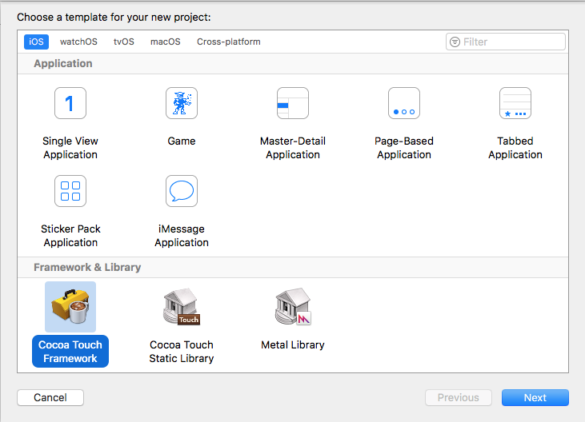

 

Product Name은 github에 올라간 repo와 동일하게 해주시면 됩니다.
 
*Include Unit Tests* 는 선택하시면 됩니다. 저는 추가하지 않겠습니다.

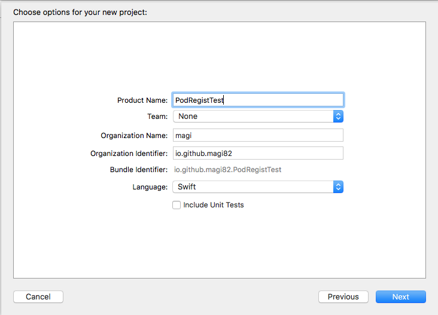

 

###### 자! 여기서 중요한 부분입니다.

지금 만드는 프로젝트는 바로 사용하지 않습니다.
 
만들어진 프로젝트는 아직까지 열어볼 필요가 없습니다.
 
프로젝트 폴더 내에 만들어진 xcodeproj 파일과 폴더를 복사해서
 
clone 된 repo에 복사하도록 하겠습니다.
 

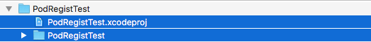

> 이렇게 하는 이유는  git repo의 root에 xcodeproj를 구성해야 하는데

> 이미 그전에 cocoapods를 등록하면서 생성된 코드 및 파일들이 있습니다.

> xcode를 통해서 프로젝트를 만들면 replace 되면서 기존 파일들이

> 전부 지워지므로, 불편하지만 위의 방법대로 진행하였습니다.

> 더 좋은 방법이 있으면 피드백 부탁드립니다.

> 물론 cocoapods를 생각하지 않고 처음부터 carthage를 적용한다면

> 굳이 이렇게 하지 않아도 됩니다.

#### framework project 세팅하기

자! 이제 프로젝트를 열어 보겠습니다. 아래 스크린샷처럼 빈 프로젝트가 보입니다.
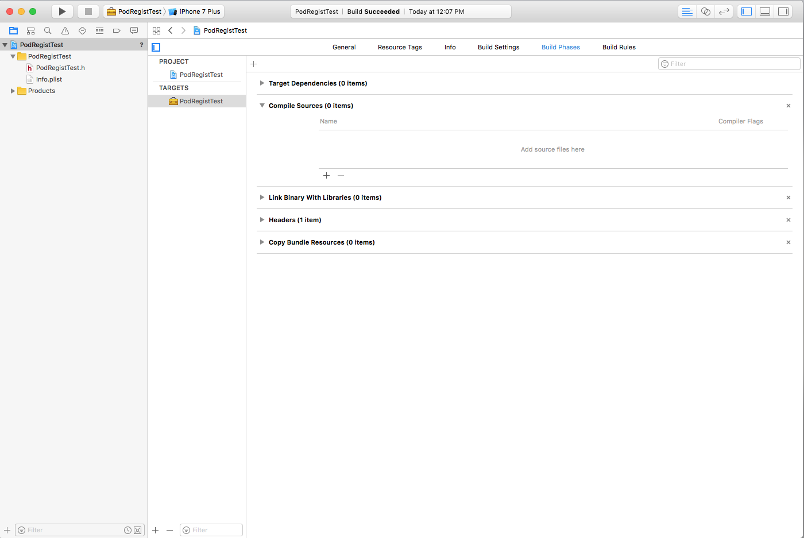
여기서 이제 Sources 폴더에 있는 swift 파일들을 등록 시켜야 합니다.
 
Sources 폴더에 있는 swift 파일들을 등록할때 주의점이 있습니다.
 
소스 파일을 복사하면 안됩니다. 링크만 걸어야합니다.
 
아래 스크린샷처럼 체크가 되어있다면 해제하도록 합시다.

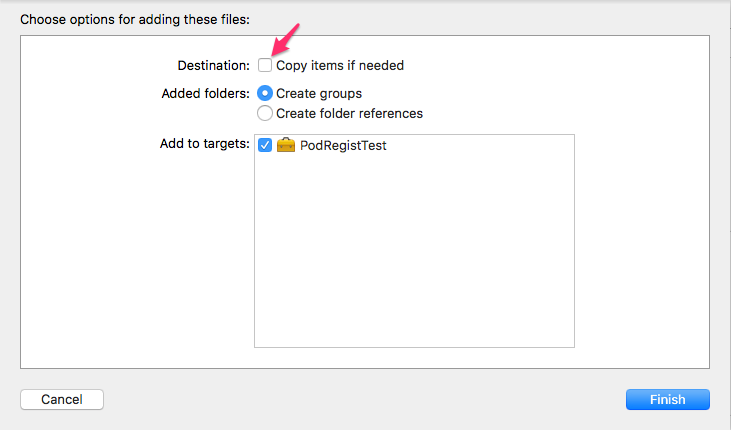

 

프로젝트에 등록후의 스크린샷입니다.
 
왼쪽 화살표에 소스 파일이 등록된게 보입니다.
 
그리고 프로젝트의 target에서 *Build Phases -> Compile Sources* 에
 
소스 파일이 등록된게 보이면 정상적입니다.
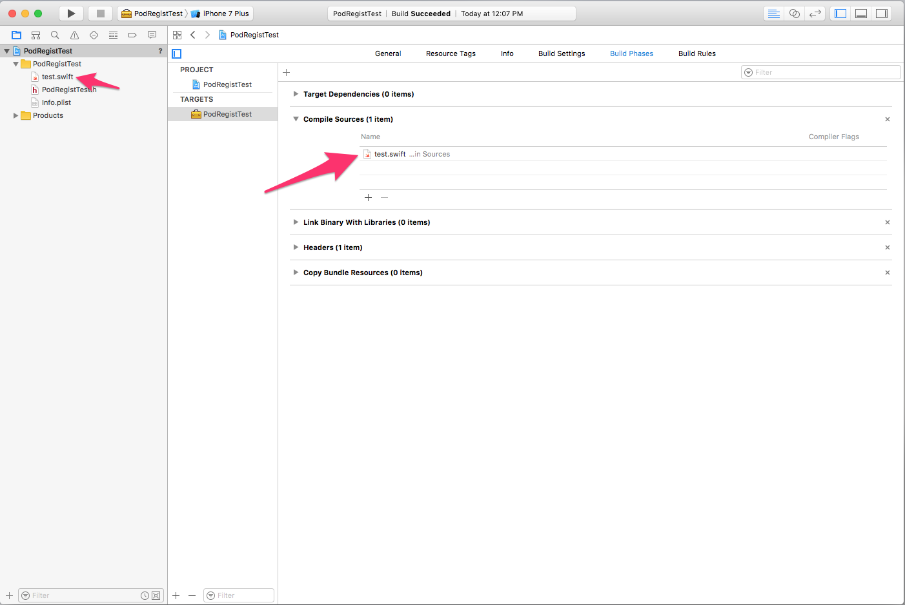
다음으로 해야할일은 framework의 scheme을 shared 해야합니다.
 
*Manage Schemes...* 메뉴를 실행합니다.

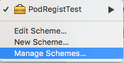

그리고 아래 스크린샷의 화살표처럼 *shared* 를 체크 합니다.

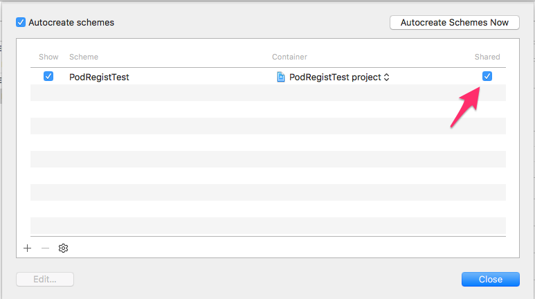

이제 프로젝트에서 해야 할일은 끝났습니다.
 
빌드가 성공적인지 확인합니다.

#### github 세팅하기

github에 해줘야할 부분은 거의 없습니다.
 
먼저 위에서 실컷 만든 프로젝트 파일들을 push 해줍시다.

다음은 tag를 추가 해야 합니다.
 
carthage도 cocoapods와 마찬가지로 tag를 통해 버전 체크를 합니다.
 
이전 cocoapods 등록시 올렸던 버전에 이어서 *0.2.0* 으로 올리도록 하겠습니다.

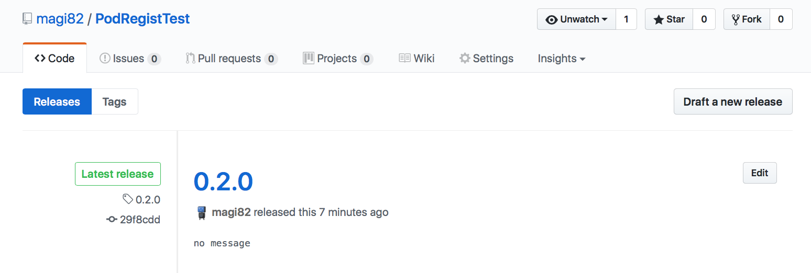

자! 이렇게만 하면 끝입니다.

#### 정상인지 확인하기

정상적으로 등록이 되었는지 확인 해보겠습니다.
 
먼저 carthage가 설치되어 있지 않다면 설치를 해야 합니다.
 
터미널에서 아래 명령어로 carthage를 설치합시다.

> brew update

> brew install carthage

그리고 라이브러리를 다운로드 받고 확인해볼 폴더를 만들고
 
폴더안에서 *Cartfile* 파일을 만들어 주세요.
 
cocoapods의 *Podfile* 과 동일한 역할을 합니다.

> vi Cartfile

그리고 등록한 라이브러리를 사용할수 있게 아래와 같이 입력합시다.

> github "[GITHUB ACCOUNT]/[REPO NAME]"

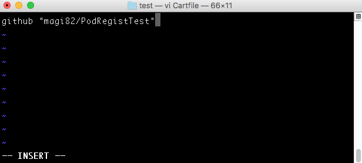

저장후 터미널에서 아래 명령어를 입력합니다.

> carthage update

아래와 같이 성공적으로 빌드가 되었습니다.

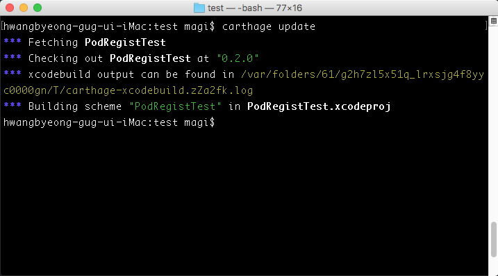

아래 스크린샷 처럼 해당 경로에 framework 파일과 소스 파일을 확인할수 있습니다.

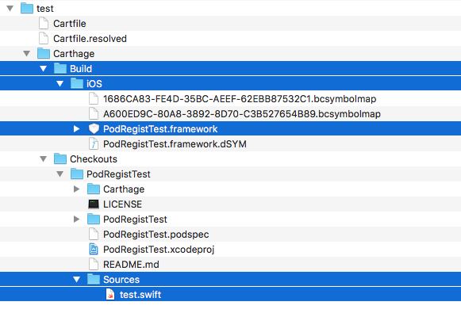

 

#### 마치며..

이제 cocoapods에 이어서 carthage도 지원이 가능하게 되었습니다.
 
각종 스크린샷도 많고 복잡해 보이지만 막상 해보면 생각보다 어렵지 않습니다.
 
다음 포스트는 github에서 무료 지원하는 travis CI를 적용 해보겠습니다.
 
다음에 뵙겠습니다.
