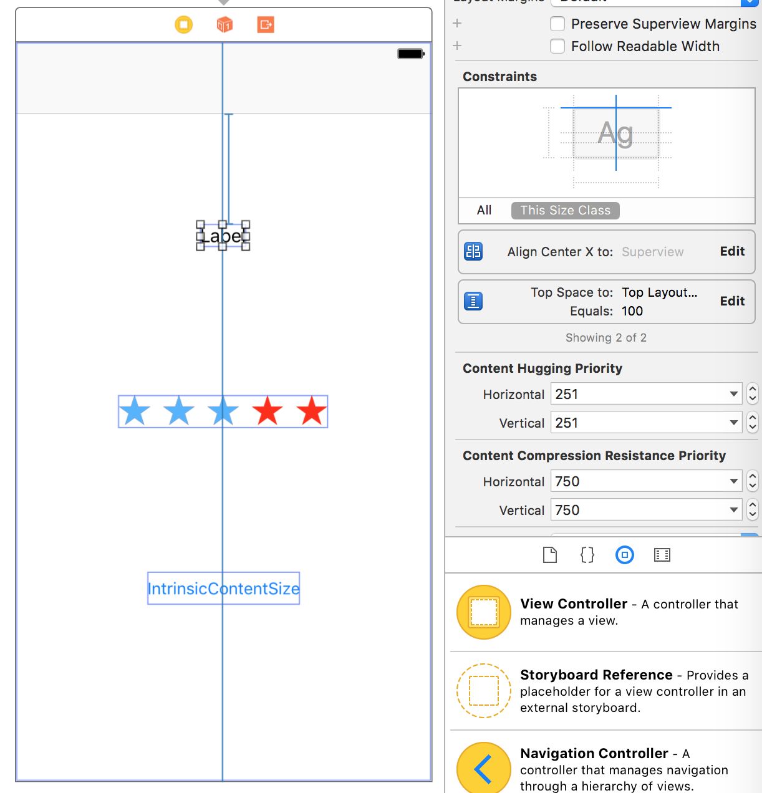
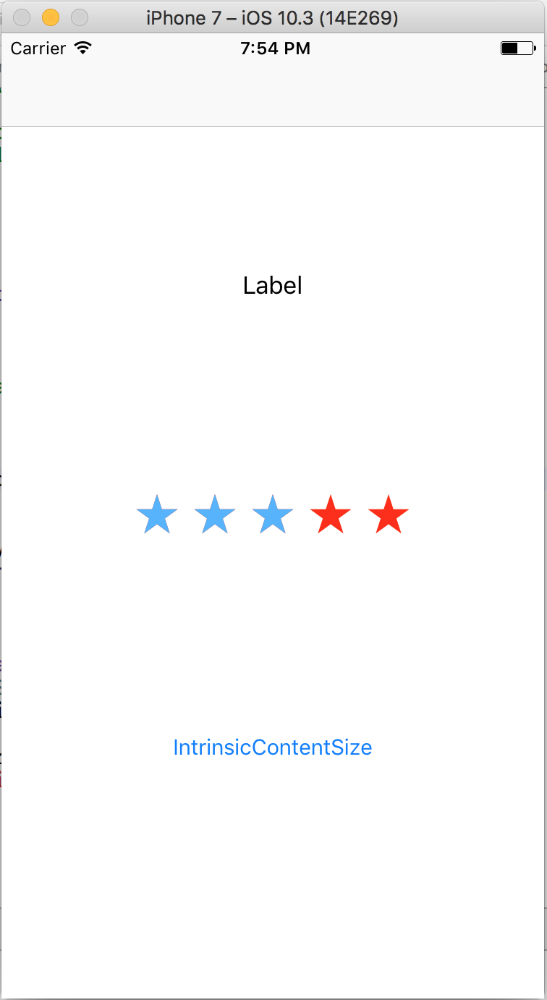
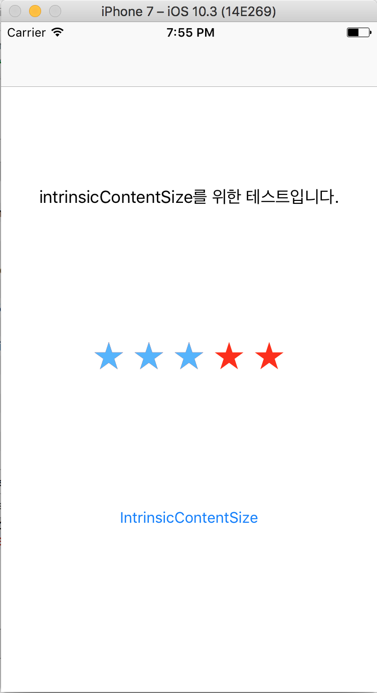
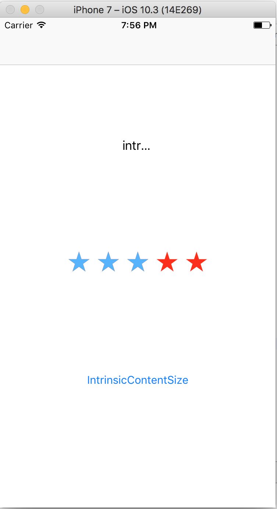
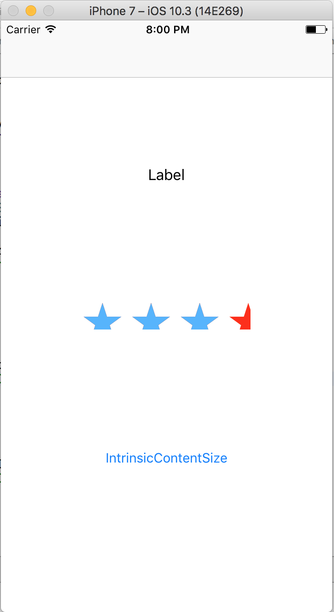
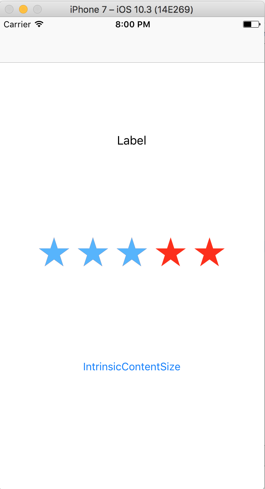

안녕하세요. 마기입니다. 이번에는 UIView API 관련 포스팅을 하려고 합니다.
 
UIView의 size와 관련된 intrinsicContentSize 프로퍼티와
 
invalidateIntrinsicContentSize() 메소드 에 대해서 알아보겠습니다.

 

#### intrinsicContentSize

일단 intrinsicContentSize의 사전적 의미를 찾아 보도록 하겠습니다.

> intrinsic Content Size : 본질적인 컨텐츠 크기

대부분의 view들은 기본적으로 컨텐츠 크기만큼의 size를 가지고 있습니다.
 
UILabel이나 UIButton을 auto layout으로 구현할때
 
제약사항으로 width와 height를 추가하지 않아도 오류가 나지 않는 이유는
 
intrinsicContentSize를 가지고 있기 때문입니다.

아래 스크린샷의 UILabel을 보시죠.
 
"Label" 이라고 text를 적용한후 width, height를 적용하지 않았습니다.
 
빨간줄이 그어지지 않았군요! 오류가 없습니다.

 

물론 런타임에서도 잘 나옵니다.

 

이번에는 IntrinsicContentSize 버튼을 눌러서 UILabel의 text 값을
 
런타임에서 변경해보도록 하겠습니다.



이번에도 잘 나오는군요! 깔끔합니다. :)

이렇게 내용이 변경되어도 auto layout이 제대로 적용되는 이유는
 
위에서 언급한 UILabel의 intrinsicContentSize 프로퍼티에서
 
컨텐츠의 크기를 계산해주기 때문입니다.

 

#### invalidateIntrinsicContentSize()

자 여기서 한가지 더 알아보도록 하겠습니다.

바로 invalidateIntrinsicContentSize() 라는 메소드인데요.
 
view의 컨텐츠 크기가 바뀌었을때 intrinsicContentSize 프로퍼티를
 
통해 size를 갱신하고 그에 맞게 auto layout이 업데이트 되도록
 
만들어주는 메소드입니다.

apple에서 제공해주는 view는 내부적으로 적용되어 있기 때문에
 
크게 신경을 쓰지 않아도 괜찮습니다.
 
다만 custom view를 구현할때는 intrinsicContentSize 프로퍼티와
 
더불어 invalidateIntrinsicContentSize() 메소드를 구현해야 합니다.

invalidateIntrinsicContentSize() 메소드를 구현하지 않으면
 
어떻게 되는지 확인해보도록 하시죠.

UILabel에서 invalidateIntrinsicContentSize() 메소드가
 
적용되지 않게 하기 위해서 아래와 같이 extension을 구현하고
 
런타임에서 text를 변경해보도록 하겠습니다.



아까와는 다르게 컨텐츠 크기만큼 view의 size가 늘어나지 않습니다.

intrinsicContentSize 프로퍼티와 invalidateIntrinsicContentSize()
 
메소드의 관계에 대해서 이제 어느정도 감이 오는군요.

자 이제 custom view를 구현할때 어떤 방식으로 해야하는지 알아보겠습니다.
 
제가 만든 rating을 위한 custom view 라이브러리가 있습니다.

> 혹시나 궁금해 하실까봐.. (그럴리가 없잖아..) 
> [MGStarRatingView](https://github.com/magi82/MGStarRatingView) 라이브러리입니다. 

intrinsicContentSize 프로퍼티는 아래와 같이 구현되어 있습니다.



런타임에서 별의 크기를 바꾸거나 간격을 조절 하는등
 
view의 크기와 관련된 메소드를 실행 했을때
 
invalidateIntrinsicContentSize() 메소드를 실행 해주지 않는다면
 
아래와 스크린샷과 같이 제대로 적용이 되지 않습니다.

하지만 이렇게 view의 컨텐츠 크기가 바뀔때
 
invalidateIntrinsicContentSize() 메소드를 실행해주면..



이렇게 제대로 적용이 됩니다.

 

#### 마치며..

일반적으로 apple에서 제공하는 view들을 사용하기 때문에
 
사용할 일이 많이 없을지도 모릅니다.
 
하지만 custom view를 만들어야 한다면..
 
꼭 필요한 내용이 아닐까 합니다.
 
다음에 뵙도록 하겠습니다.

