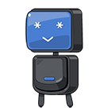

안녕하세요. 마기입니다.<br>
이번 포스팅에서는 델리게이트에 대해 살펴보도록 하겠습니다.<br>
iOS 에서 델리게이트 패턴은 정말 많이 쓰이고 있습니다.<br>
많이 쓰이는 필수 패턴이니만큼 구글링을 해보면 여러 블로그에 많은 사용법들이<br>
포스팅되어 있습니다.

하지만 그럼에도 불구하고 여전히 델리게이트 패턴에 대해 어려워하고<br>
햇갈려 하는 분들이 계십니다.<br>
그래서 이번 포스팅은 사용법보다는 어디에 쓰이는지.. 왜 쓰이는지..<br>
도대체 왜 햇갈리는지에 대해서 다뤄 보도록 하겠습니다.

다음 순서대로 한번 알아보시죠.
- 델리게이트는 무엇인가
- 어디에 쓰이는가
- 굳이 왜 사용하는가

<br>

#### 델리게이트란 무엇인가

자 언제나 그랬듯이 먼저 사전적 의미를 찾아 볼텐데요.

> 델리게이트 : 대리자, 위임자

이런 의미를 찾을수가 있습니다.<br>
그런데.. 뭔가 좀 애매합니다. 이해가 잘 가질 않아요.<br>
뭘 대리한다는거지? 뭘 위임한다는거지?<br>
물론 이미 이해하신분들은 저거 맞는데? 라고 하시겠지만..<br>
이해 하지 못하신분들은 꽤나 애매한 의미라고 생각합니다.

얼마전 지인 개발자분과 개발 관련 잡담을 하다가<br>
델리게이트에 대한 이야기가 나왔습니다.<br>
델리게이트의 의미로써 단순히 대리자는 별로 맞지 않다라는 내용이었죠.<br>
지인분은 확장자가 맞지 않느냐고 말씀하셨고<br>
저도 그 의미에 대해서 공감을 얻었습니다.<br>
대리자, 위임자의 의미는 대신 무엇인가를 처리한다는 의미인데..<br>
델리게이트 구현한다고 그 객체의 일을 완전히 대신해주는건 아니거든요.

그래서 이렇게 구체적으로 정의를 내리고 싶습니다.
> 델리게이트는 어떤 객체가 해야 하는 일을 부분적으로<br>
> 확장해서 대신 처리를 한다.

<br>

#### 어디에 쓰이는가

위에 설명드렸듯이 델리게이트의 의미는..<br>
객체가 해야할일을 부분적으로 확장해서 대신 처리를 해준다는건데요.<br>
델리게이트는 두가지만 기억하면 됩니다.(북치기? 박치기? 네.. 전 아재입니다.)<br>
대신 처리 해줄 객체와 처리하라고 시키는 객체 입니다.

이래도 감이 안오신다고요?<br>
하지만 몇가지 예를 들어보면 분명히 감이 올겁니다. 확신합니다! (정말?)<br>

자! 고객이 여러곳에서 사용할수 있는 메시지창을 하나 만들어 달라고 합니다.<br>
메시지창에는 버튼이 있고 누르면 뷰컨트롤러는 무슨 버튼을 눌렀는지 체크 해서<br>
그 버튼이 이벤트가 발생하면 해야하는 일들을 처리 해야 한다고 합니다.<br>
두가지만 기억하시라고 말씀드렸죠?<br>
지금 말하는 뷰컨트롤러가 대신 처리 해줄 객체이고<br>
메시지창이 처리를 하라고 시키는 객체입니다.<br>

자 일단 메시지창을 만들어야겠죠? 간단하게 만들어 보겠습니다.



자 메시지창을 완성했습니다.<br>

```swift
weak var delegate: MessageBoxDelegate?
```

프로토콜 프로퍼티는 대신 처리 해줄 객체를 저장해둘 프로퍼티입니다.<br>
저장을 해놔야 막상 일을 시켜야할때 시켜줄수 있겠죠?

자 이제 대신 처리를 해야하는 객체에 델리게이트 구현을 해보겠습니다.



자! 여기서 살펴봐야할 포인트가 있습니다.<br>
어떤 객체가 다른 객체에게 처리해야 할일을 시키려면 대신 처리해야할<br>
객체를 가지고 있어야 하겠죠?<br>
바로 26 라인의 구문입니다.

```swift
msg.delegate = self
```

이렇게 저장을 해줍니다.<br>
여기서 잠깐.. 왜 갑자기 self를 넣는거냐고 궁금해 하시는 분들이 간혹 계십니다.<br>
프로토콜을 상속받고 구현하게 되면 상속받은 프로토콜로 형변환이 가능해집니다.<br>
이 포스팅에서는 이정도로만 설명을 드리도록 하겠습니다.<br>
자세한 내용은 객체지향 관련해서 검색하시면 찾으실수 있습니다.

자 이제 버튼을 누르면 저장 해둔 델리게이트 객체의 프로퍼티를 통해 구현 메소드를<br>
실행할수 있습니다.

한가지 예를 더 들어보겠습니다.<br>
이번에는 애플에서 구현된 델리게이트 프로토콜을 알아보겠습니다.<br>
가장 많이 쓰인다고 생각되는 UI는 역시나 테이블뷰겠죠.<br>

테이블뷰에는 두가지 델리게이트가 있습니다.<br>
UITableViewDelegate, UITableDataSource 입니다.<br>
위에서 이야기한 기억해야할 두가지중에서 테이블뷰가 들어간 뷰컨트롤러는<br>
처리를 해야하는 객체 입니다.<br>
뷰컨트롤러에 델리게이트를 상속 받고 구현한 후에<br>
처리하라고 시키는 객체(실제 테이블뷰)에 해당 델리게이트 객체를 넣어줍니다.<br>



#### 굳이 왜 사용 하는가

이제 마지막 순서입니다. 굳이 왜 사용 하는가!<br>
사실 사용하지 않아도 프로그램을 만들수는 있습니다. 다만 불편할뿐이죠.<br>
(클로저나 노티피케이션 센터는 또 다른 방법이므로 여기서는 가볍게 무시하기로 하겠습니다.)<br>

간혹 이런 개발자분들이 계십니다.<br>
> 그냥 객체에서 처리해야할 내용들을 넘겨줘서 처리하면 안되요?

네 뭐.. 그렇게 해도 일단은 되긴 됩니다. 하지만 상황에 따라 다르죠.<br>
전용으로 만든다고 하면 상관없습니다.<br>
하지만 범용적이고 재사용성을 추구한다면 추천할만한 방법이 아닙니다.<br>
위의 예제인 메시지박스로 다시 예를 들어보겠습니다.<br>

고객이 어디서든 메시지박스를 띄우고 눌렀을때 어떠한 작업을<br>
처리 할수 있게 해달라고 했는데..<br>
그 작업을 메시지박스 내에서 일을 처리 해주려고 합니다.<br>
문제는 메시지박스를 쓰는부분마다 처리해야하는 내용이 다르다면..?<br>
똑같이 생긴 메시지박스를 여러개 만들어서 처리를 해줘야합니다.<br>
물론 상속을 받아서 처리할부분만 처리해주면 되지만<br>
그래도 클래스가 늘어나는건 어쩔수가 없습니다.

하지만 델리게이트 패턴을 사용한다면?<br>
메시지박스는 대신 일을 처리할 델리게이트 구현 객체에 대해서<br>
따로 신경 쓰지 않아도 됩니다.<br>
가지고 있는 델리게이트 프로토콜 프로퍼티를 통해서<br>
대신 해달라고 시키기만 하면 되죠.

이런 개발자분들도 계십니다.<br>
> 굳이 프로토콜로 델리게이트 구현해야 하나요?<br>
> 그냥 객체를 통째로 넘겨줘서 메소드 실행하면 안되나요?

역시나 좋은 방법이 아닙니다.<br>
객체를 그냥 통째로 넘겨줘 버리면 굳이 처리해야할부분<br>
이외의 부분까지 한번에 넘어가게 됩니다.<br>
물론 처리해야할부분만 처리하고 나머지는 안건든다는 각오로 잘 관리하면 되겠지만<br>
사람이 하는 이상 완벽하지 않습니다.<br>
하지만 프로토콜은 하나의 약속입니다. 정해진 메소드만 구현하겠다! 라는거죠.<br>
상속 및 구현된 프로토콜을 프로퍼티로 가지고 있으면<br>
해당 프로퍼티에서는 약속된 메소드만 실행 가능하게 됩니다.

그리고 범용적이고 재사용성을 추구한다면 이방법은 더더욱 좋은 방법이 아니게 됩니다.<br>
결국 처리하기 위해 통째로 넘겨받은 객체는 전용적인 성격을 띄게 되므로<br>
필요할때마다 클래스를 만들어야하죠.

#### 마치며..

단순한 사용법이 아닌 어디에 쓰이는지 왜 쓰이는지에 대한<br>
이야기는 정말 어려운거 같습니다.<br>
개인적인 생각도 들어가게 되고 제가 잘못된 내용으로 이해를 하고 있으면<br>
위험한 발언이 될수도 있는거 같습니다. 어그로를 끌게 될수도 있구요.<br>
어떠한 부분이 이상하거나 잘못된 내용이 있으면<br>
언제든지 피드백을 주시면 정말 감사하겠습니다.<br>
이상 마기였습니다.


