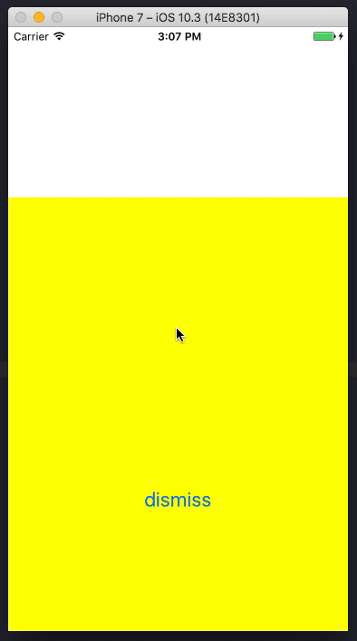

안녕하세요. 마기입니다. 오래간만에 포스팅을 하는거 같습니다.
 
이번에는 UIModalPresentationStyle 에 대해서 알아보고자 합니다.
 
다양한 스타일이 있는 만큼 나눠서 포스팅할 예정 입니다.

이번 포스팅에서는 아래 4가지 스타일에 대해서 알아보도록 하죠!
- fullScreen
- currentContext
- overFullScreen
- overCurrentContext

 

## UIModalPresentationStyle

각각 스타일을 알아보기전에 **UIModalPresentationStyle** 에 대해 알아보겠습니다.
 
애플 개발자 문서를 통해 검색을 해보면 아래와 같이 설명하고 있습니다.

> Modal presentation styles available when presenting view controllers.

뷰컨트롤러를 표시할때..
 
즉, **present** 할때 사용 할수 있는 모달 프레젠테이션 스타일 입니다.
 
당연하게도 NavigationController의 push와는 상관이 없습니다.

이제 하나하나 살펴보도록 하죠.

 

## fullScreen

먼저 살펴볼 스타일은 **fullScreen** 스타일입니다.
 
애플 개발자 문서에는 아래와 같이 설명하고 있습니다.

> A presentation style in which the presented view covers the screen.

문서에서 설명한 내용 그대로.. 그리고 키워드의 의미 그대로 입니다.
 
표시될 뷰컨트롤러의 뷰가 화면 전체에 표시되는 스타일입니다.

이 옵션은 **기본 옵션** 이므로 보통 개발할때 별다른 세팅 없이 present 하게 되면
 
아래와 같이 화면 전체를 덮게 됩니다.



 

## currentContext

**currentContext** 라는 스타일은 아래와 같이 설명 하고 있습니다.

> A presentation style where the content is displayed over another view controller’s content.

해석 해보자면 다른 뷰컨트롤러의 컨텐츠.. 
 
즉, 다른 뷰컨트롤러의 뷰를 통해 표시 된다는 스타일입니다.

아래와 같이 코드상에서 적용 해봅시다.



이렇게 세팅을 해도 앞서 살펴봤던 fullScreen과 별반 차이가 없어보입니다.

그래서 보통 아 뭐지.. 하고 그냥 넘어가는 경우가 허다하죠.

**이번 포스팅에서 중점적으로 살펴볼 스타일 입니다.**
 
확실히 이해를 하기 위해 간단하게 예제를 만들어 보겠습니다.
 
currentContext의 구현을 확인하기 위한 임시 코드입니다.



이렇게 표시를 담당하게될 뷰컨트롤러의 뷰를 작게 만들었습니다.
 
*실제 작업에서는 이런식으로 뷰컨트롤러의 뷰 프레임을 수정하지 않습니다.*

이제 확인을 해보죠

이제 차이점이 이해가 가시나요?
 
**fullScreen** 은 디바이스의 스크린에 대응 하는 스타일입니다.
 
**currentContext** 는 present를 지시하는 뷰컨트롤러의 컨텐츠..
 
즉, 뷰위에서 표시가 됩니다.

개발을 하면서 상황에 따라 분명히 써먹을때가 있을거 같군요!
 
그중에 간단하게 예시를 하나 들어보겠습니다.

보통 많은 앱들이 TabBarController을 가지고 있고,
 
TabBarController의 하위에 NavigationController가 있으며
 
실제 컨텐츠 뷰컨트롤러들이 push 되어있습니다.

이런 구조의 앱에서 컨텐츠 뷰컨트롤러로부터 모달 뷰컨트롤러를 present할때,
 
기획적으로 스크린 전체를 덮어버리는게 아닌
 
하단 탭바를 보이게 해야하는 상황이 올수도 있습니다.
 
스타일을 따로 세팅하지 않으면 기본값인 **fullScreen**이 적용 되어 있어서
 
화면 전체를 덮어 버립니다.



자, 그럼 이제 currentContext로 세팅 해보도록 하겠습니다.



하단 탭바가 보이는군요! 만족스럽습니다. :)

음... 그런데 뭔가 좀 이상하군요.. 눈치 채셨나요??
 
위에서 설명했던 currentContext 스타일은 분명히 
 
present를 지시한 뷰컨트롤러의 뷰 위에서 표시된다고 했는데
 
NavigationController의 뷰 위를 덮어버렸네요.
 
네비게이션바가 보이지가 않네요. 생각하던거와 다르니 영 껄끄럽습니다.

자! 바로 아래에 설명할 내용이랑 연관이 있습니다.

 

## definesPresentationContext

뷰컨트롤러에는 이런 프로퍼티가 내장 되어 있습니다.
 
이 프로퍼티의 역할을 한번 알아볼텐데요.
 
일단 선언부에 작성된 주석을 한번 보도록 하겠습니다,

> Determines which parent view controller's view should be presented over for presentations of type UIModalPresentationCurrentContext. 
> If no ancestor view controller has this flag set, then the presenter will be the root view controller.

봐도 막 와닿진 않는군요.
 
이 프로퍼티는 위에서 의아해했던 상황의 해답입니다.
 
모달 뷰컨트롤이 currentContext 스타일로 present 될때
 
조건이 두가지가 있습니다.

1. **present** 를 지시한 뷰컨트롤러의 최상위 계층 컨트롤러가 표시중인 뷰
2. **definesPresentationContext** 프로퍼티가 **true**인 뷰컨트롤러의 뷰

즉, 더이상 상위가 없는 루트 뷰컨트롤러의 뷰에서 표시가 되거나,
 
최상위 뷰를 찾으러 올라가다가 해당 프로퍼티가 true인게 체크가 되면
 
해당 뷰컨트롤러의 뷰에 표시가 됩니다.

일반 뷰컨트롤러는 해당 프로퍼티가 기본적으로 **false** 이고,
 
컨테이너 뷰컨트롤러.. TabbarController, NavigationController는
 
기본적으로 **true**로 세팅이 되어 있습니다.
 
그래서 위의 예제에서 최상위 뷰컨롤러를 찾다가 네비게이션 뷰컨롤러의 프로퍼티를 보고
 
네비게이션 뷰컨롤러의 뷰에 정착(?) 한것이죠!

간단하게 예제를 보도록 하겠습니다.
 
실제 컨텐츠 뷰컨트롤러의 프로퍼티를 true로 세팅해 보겠습니다.



이제 네비게이션바도 보이기 시작하는군요!

자 이번에는 TabbarController의 뷰 위에 표시를 해보겠습니다.
 
하위 뷰컨롤러들의 **definesPresentationContext** 프로퍼티를 전부 false로 세팅하면
 
최상위 뷰컨롤러의 뷰까지 올라갑니다.



최상위 TabbarController의 뷰위에 표시 했기때문에 전체 화면을 덮어버립니다.
 
잘되는군요. :)

이 프로퍼티가 낯설게 느껴지시나요? 아닙니다.
 
이미 사용 경험이 있으실겁니다. 
 
SearchBar를 사용할때 예제를 검색해보면 많은 블로그에서
 
해당 프로퍼티를 true로 세팅해주고 있습니다.

여러 개발 상황에 따라 유용하게 쓰여질거 같군요. :)

 

## overFullScreen, overCurrentContext

나머지 두가지의 스타일에 대해서 마저 보도록 하겠습니다.
 
이 두가지 스타일은 위에서 설명한 스타일과 거의 똑같습니다.
 
다만 조금 다른점이 있습니다. 바로 뷰의 **alpha** 값이 적용이 됩니다.

어떻게 다른지 비교해보도록 하겠습니다.

alpha값을 세팅했지만 불투명하게 보여지는군요.



자, 이제 스타일을 바꿔보겠습니다.



이제 alpha값이 잘 적용 되는군요!!

## 마치며..

이번 포스트에서는 모달 프레젠테이션 스타일에 대해서 알아봤습니다.
 
역시 그냥 사용하는것보다 알고 사용 하는것이
 
올바르게 사용할수 있는거 같습니다.
 
다음 포스팅은 나머지 스타일에 대해서 알아보도록 하겠습니다.

이상 마기였습니다.

 

---

#### 목차

- [iOS UIModalPresentationStyle 알아보기(currentContext, FullScreen) - 01](https://magi82.github.io/ios-modal-presentation-style-01/)